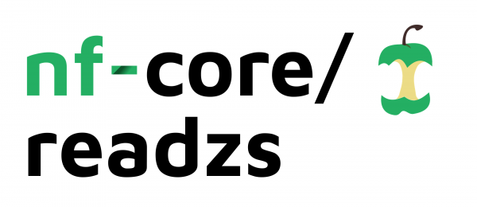

# 

## Introduction

<!-- TODO nf-core: Write a 1-2 sentence summary of what data the pipeline is for and what it does -->
**salzmanlab/readzs** is a bioinformatics best-practice analysis pipeline for The Read Z-score (ReadZS): a metric that summarizes the transcriptional state of a gene in a single cell.

The pipeline is built using [Nextflow](https://www.nextflow.io), a workflow tool to run tasks across multiple compute infrastructures in a very portable manner. It uses Docker/Singularity containers making installation trivial and results highly reproducible. The [Nextflow DSL2](https://www.nextflow.io/docs/latest/dsl2.html) implementation of this pipeline uses one container per process which makes it much easier to maintain and update software dependencies. Where possible, these processes have been submitted to and installed from [nf-core/modules](https://github.com/nf-core/modules) in order to make them available to all nf-core pipelines, and to everyone within the Nextflow community!

## Pipeline summary

<!-- TODO nf-core: Fill in short bullet-pointed list of the default steps in the pipeline -->

1. Filter and quantify read enrichment from bam files
2. Calculate the ReadZS (read z-score) for single cells across genomic bins
3. Downstream analyses
    1. Aggregate the ReadZS along cell-type annotations and identify windows of interest
    2. Plot read distributions for cell-types in windows of interest
    3. Perform GMM-based subclustering to identify peaks
    4. Annotate peaks with distances to annotated features

## Quick Start

## Input Arguments

| Argument                | Description     |Example Usage  |
| -----------             | -----------     |-----------|
| `runName`               | Descriptive name for ReadZS run, used in the final output files |*Tumor_5* |
| `input`      | Input samplesheet in csv format, format detailed below | `Tumor_5_samplesheet.csv` |
| `useChannels`            | `true` if the same samples were split across multiple lanes with barcode overlap between samples | `true`, `false` |
| `isSICILIAN`            | If the input bam files are output from [SICILIAN](https://github.com/salzmanlab/SICILIAN)| `true`, `false` |
| `isCellranger`          | `true` if input data is output from Cellranger | `true`, `false` |
| `ontologyCols	`         | Double-encapsulated list string describing the `metadata` columns that will create the cell-type variable | "'tissue, compartment, annotation'" |
| `metadata`              | Path to cell-type annotation file, described below | `metadata_Tumor5.tsv` |
| `chr_lengths`           | Two-column, tab-delimited file containing chromosome names in the first column and chromosome lengths in the second column. Chromosome names must match those in bam files. | */home/refs/human.chrs* |
| `gff`                   | Location of genome GFF file, used for plotting; can be obtained from [GENCODE](https://www.gencodegenes.org/human/) | */home/refs/humanv37.gff* |
| `annotation_bed`        | BED-formatted file, used to annotate the windows, e.g. "refFlat" table of genes in BED format obtained from [UCSC Table Browser](https://genome.ucsc.edu/cgi-bin/hgTables)| */home/refs/hg38_genes.bed*  |
| `picard`                | Location of [Picard](https://broadinstitute.github.io/picard/) executable file | */home/software/picard.jar* |

## Default Parameters
| Argument                | Description     | Default Value  |
| -----------             | -----------     |-----------|
| `binSize`               | Size of genomic bins, used to calculate z-scores | *5000*  |
| `minCellsPerWindowOnt`  | Minimum cells per window-ontology required to calculate medians for that window-ontology | *20*  |
| `minCtsPerCell`         | Minimum counts per cell for a window required to include this cell in calculating medians for that window-ontology| *10*  |
| `nPermutations`         | Number of permutations to be used in median calculation | *1000* |
| `nGenesToPlot`          | Number of top windows to generate read distribution histograms for| *20* |

## Pipeline Parameters
By default, these boolean parameters are all `false`, in order to run every step of the pipeline. These parameters can be used to modify which steps are run, or to re-run analysis steps on previously completed steps.
| Argument                | Description     | Additional requirements  |
| -----------             | -----------     |-----------|
| `zscores_only`          | Calculate ReadZS values for cells over genomic bins, without annotating cells with cell-types or any downstram analyses. | If `true`, `plot_only` and `subcluster_only` cannot be `true` |
| `skip_plot`             | Run all steps of pipeline, except for plot generation of read distributions. | If `true`, `plot_only` cannot be `true` |
| `skip_subcluster`       | Run all steps of pipeline, except for subclustering/peak calling. | If `true`, `subcluster_only` cannot be `true`  |
| `plot_only`             | If all steps up to median calculation have been previously performed, only perform plot generation of read distributions. | `all_pvals_path` , `resultsDir`|
| `subcluster_only`       | If all steps up to annotation steps have been previously performed, only perform subclustering/peak calling.| `counts_path`, `ann_pvals_path`|
| (`--plot_only`) `all_pvals_path`        | Path to all_pvals file. | *home/results/`${runName}`_all_pvals.txt* |
| (`--plot_only`) `resultsDir`            | Path to results directory of previous run. | *home/results*  |
| (`--subcluster_only`) `counts_path`           | Path to results directory for counts files. | *home/results/counts* |
| (`--subcluster_only`) `ann_pvals_path`        | Path to ann_pvals file. | *home/results/`${runName}`_nn_pvals.txt* |
## Credits

nf-core/readzs was originally written by the Salzman Lab.

We thank the following people for their extensive assistance in the development of this pipeline:

<!-- TODO nf-core: If applicable, make list of people who have also contributed -->

## Contributions and Support

If you would like to contribute to this pipeline, please see the [contributing guidelines](.github/CONTRIBUTING.md).

For further information or help, don't hesitate to get in touch on the [Slack `#readzs` channel](https://nfcore.slack.com/channels/readzs) (you can join with [this invite](https://nf-co.re/join/slack)).

## Citations

<!-- TODO nf-core: Add citation for pipeline after first release. Uncomment lines below and update Zenodo doi and badge at the top of this file. -->
<!-- If you use  nf-core/readzs for your analysis, please cite it using the following doi: [10.5281/zenodo.XXXXXX](https://doi.org/10.5281/zenodo.XXXXXX) -->

<!-- TODO nf-core: Add bibliography of tools and data used in your pipeline -->
An extensive list of references for the tools used by the pipeline can be found in the [`CITATIONS.md`](CITATIONS.md) file.

You can cite the `nf-core` publication as follows:

> **The nf-core framework for community-curated bioinformatics pipelines.**
>
> Philip Ewels, Alexander Peltzer, Sven Fillinger, Harshil Patel, Johannes Alneberg, Andreas Wilm, Maxime Ulysse Garcia, Paolo Di Tommaso & Sven Nahnsen.
>
> _Nat Biotechnol._ 2020 Feb 13. doi: [10.1038/s41587-020-0439-x](https://dx.doi.org/10.1038/s41587-020-0439-x).
